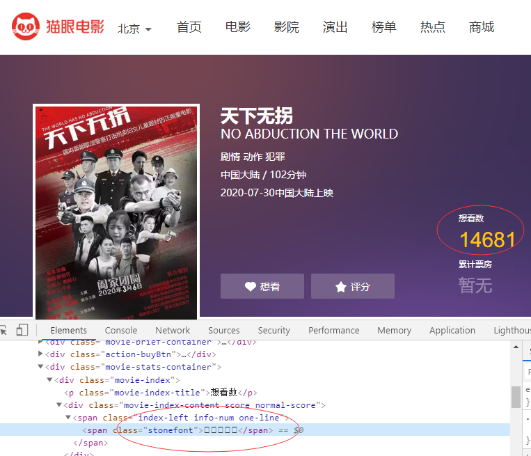
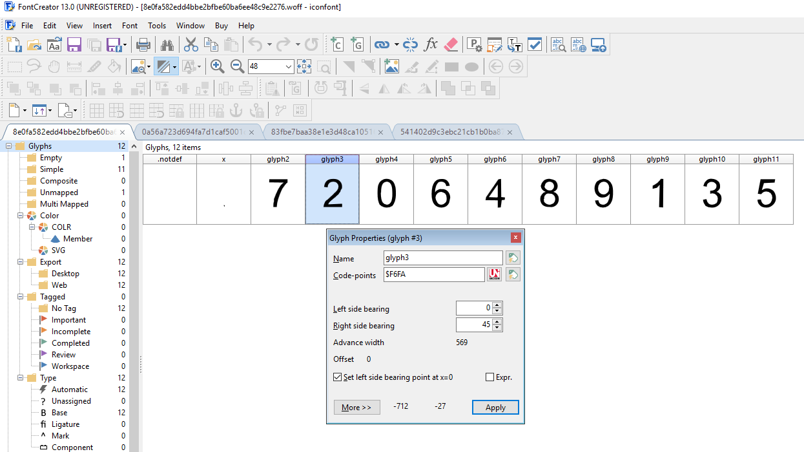

# Font Encryption Technique
The python module could be extended for any site who uses same **Font Encryption Technique**.

Recently, the font encryption technique is widely used for many Chinese sites for prevent data scraping, those senstive data such as the digits(0~9) are encoded
using a special method - Font encryption, below is an typical example on maoyan.com (a popular movie site in Chinese)



Obviously, the numbers from HTML Source is encoded as HTML entities (unicode text), even you decode the HTML entities as unicode text, it's still messing chars that's not the actual numbers as you desired.
```
<span class="index-left info-num one-line"><span class="stonefont">&#xea90;&#xe607;&#xe94e;&#xea90;&#xf351;</span></span>
```

# Decryption functions in [font_decrypt.py](font_decrypt.py)
- Python 2.7
- Python 3.x

It is the major module to decrypt the numbers encrypted in Font. 
In general, you might just exploit the below two methods to decrypt the numbers :
### decryptHtmlNumbers 
**s** is the original HTML entity text that looks like 
&amp;#xF09F;&amp;#xE690;&amp;#xEA64;&amp;#xF031;&amp;#xE238;&amp#xF031;
&amp;#xE238;.&amp#xF031;
**Note**, **s** only allows the encoded HTML entity or dot.
**font** can be either url or local font file path, when 'http://' or 'https://' is leading of this parameter, it's treated as font url ,
otherwise, it's a local font file path.
**Returns** the actual numbers displaying on HTML page.

### decryptRawNumbers  
It's same usage as decryptHtmlNumbers, except for the parameter **s** should be raw unicode text

### Example commands to implement the function "decryptHtmlNumbers"
python font_decrypt.py -d "&amp;#xe256;&amp;#xec6f;&amp;#xe36a;&amp;#xeb21;&amp;#xeb21;" "http://vfile.meituan.net/colorstone/99723393b6b3b11a46b8c30e711ae0032280.woff"

# Dependency
[fontTools lib](https://github.com/fonttools/fonttools) is required.

# Principle (Font Encryption / Decryption)
As mentioned before, the encrypted numbers can be seen in HTML source:
```
<span class="index-left info-num one-line"><span class="stonefont">&#xea90;&#xe607;&#xe94e;&#xea90;&#xf351;</span></span>
```
Figuring out that the displaying text is rely on font-family: stonefont
```
.stonefont {
    font-family: stonefont;
}
```
And the actual font file in here:
```
  <style>
    @font-face {
      font-family: stonefont;
      src: url('//vfile.meituan.net/colorstone/ceac9a4fb813b00f2c681b4dae3c4c773456.eot');
      src: url('//vfile.meituan.net/colorstone/ceac9a4fb813b00f2c681b4dae3c4c773456.eot?#iefix') format('embedded-opentype'),
           url('//vfile.meituan.net/colorstone/259b2a69d2fedfed719b8dcfe9c3a0022284.woff') format('woff');
    }

    .stonefont {
      font-family: stonefont;
    }
  </style>
```
Font file has defined the character mapping table which specific character code(in unicode) corresponds to certain glyph contours,
we can easily figure out the mapping table by the tool [Font Creator](https://www.high-logic.com/font-editor/fontcreator)



Code points - $F6FA is corresponding to that glyph as displaying number '2' 
$F6FA is the exactly matching the Hex HTML char - &amp;#xF6FA
You might guess that you should use the mapping table to get the actual number '2', 
well, if the numbers always is encrypted using same one font file, that should be fine.
But if the font is variable to be loaded dyanmically, in other words, the character mapping table will be changed,
you will have to manually look on the glyph contours to finialize the new mapping, 
The codes has ability to make a AI training to find the new mapping automatically by comparing an existing mapping as we finalized.

## AI Training for comparing the similarity between glyphs
The key point is to find a method scoring the similary of the glyph aganist to existing mapping.
See below code line:
```
score = getVar(pt_divs) * (std_pt_num-min(std_pt_num,same_pt_cnt*10))/std_pt_num * max(1, abs(std_pt_num-comp_pt_num)) # important formula to score the similarity
```
There are three key factors affecting the similarity detection:

1. The variance based on all contour points comparison - getVar(pt_divs) , pt_divs is the list of ratio between the featurizes of tow points, lowest variance means higher similarity.
2. Number of same points - same_pt_cnt , more same points means higher similarity.
3. The difference of how many points between two glyphs, lower similarity is on higher difference.

  - Accuracy & Sample training
  Currently, there is only one font sample(i.e, the font file .woff in Repo.) that we knew its character mapping hereby for AI training, you might join more than one font samples for AI training for increase the accuracy.
  
  - ### Use existing AI libs
  Such as Sklearn, Numpy, Scipy, Pandas etc. they also provide methods in consine / variance comparison for learning the similary, if think that the current way to compare the similarity is not much good, then you can consider using these libs for AI training.

# Quick test
[font_decrypt.py](font_decrypt.py) contains a fixed list of fonts for testing, it does convert the encrypted HTML numbers to the actual numbers.
```
python font_decrypt.py -test
```

Yet you can pass the page url(maoyan.com) where to load the special font and HTML numbers, this will extract the actual numbers.
Note: every time you run the command with same page url, it will load different fonts as randomly, in case you should continously check the returned result to see if the AI training does the decryption accurately !
```
python font_decrypt.py -test_maoyan "https://maoyan.com/films/1226583"
```

# References
**Machine Learning :: Cosine Similarity for Vector Space Models (Part III)**
http://blog.christianperone.com/2013/09/machine-learning-cosine-similarity-for-vector-space-models-part-iii/
**字体加密破解技术分享-01**
https://zhuanlan.zhihu.com/p/108207403

# Warning
You can use the codes for free for personal purpose only, you will be responsible for any legal suit in commercial usage.
